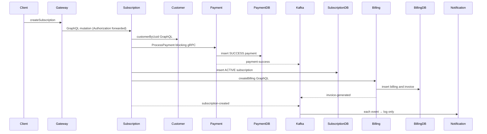

# Business flows

## Customer registration/login

`AuthMutation.register` → `AuthenticationServiceImpl.register` → `CustomerRepository.existsByEmail/save`; it BCrypt-hashes the password, saves ACTIVE/CUSTOMER customer, and returns an `AuthResponse` with **null accessToken** (`customer-service/src/main/java/com/ayush/subscription/customer/graphql/mutation/AuthMutation.java`; `.../service/impl/AuthenticationServiceImpl.java`). Register validates the request at the resolver. `AuthMutation.login` → `AuthenticationServiceImpl.login` → `findByEmail`, BCrypt match, `JwtUtil.generateToken`; it returns HS256 JWT claims subject/email/customerUuid/role (`.../util/JwtUtil.java`). No Kafka, cache update, or external call.

Create/update/delete: `CustomerMutation` delegates to `CustomerServiceImpl`. Create checks email and saves ACTIVE; update is transactional, checks email collision, saves and `@CachePut(customers,#customerUuid)`; delete is transactional soft delete to DELETED and `@CacheEvict` (`.../graphql/mutation/CustomerMutation.java`; `.../service/impl/CustomerServiceImpl.java`). Queries use repository and `getCustomerByUuid` uses `@Cacheable`. No ownership check compares the JWT principal with requested UUID.

## Plan

`SubscriptionPlanMutation.{createPlan,updatePlan,deletePlan}` → `SubscriptionPlanServiceImpl`; create checks name and saves ACTIVE, update saves all supplied fields, and delete physically deletes. Reads/update/delete use `subscriptionPlans` cache; create does not populate it (`subscription-service/src/main/java/.../graphql/mutation/SubscriptionPlanMutation.java`; `.../service/impl/SubscriptionPlanServiceImpl.java`). No validation annotations, auth, event, or external calls.

## Subscription/payment/billing/invoice/notification

The method chain is `SubscriptionMutation.createSubscription` → `SubscriptionServiceImpl.createSubscription` → `CustomerServiceClient.getCustomerByUuid` → plan repository → `PaymentGrpcClient.processPayment` → `PaymentGrpcServiceImpl.processPayment` → `PaymentServiceImpl.createPayment` → `PaymentRepository.save` → `BillingServiceClient.createBilling` → `BillingMutation.createBilling` → `BillingServiceImpl.createBilling` → `BillingRepository.save`/`InvoiceRepository.save` (`subscription-service/src/main/java/...`, `payment-service/src/main/java/...`, `billing-service/src/main/java/...`). Payment helper unconditionally sets SUCCESS and CARD; no processor call occurs (`payment-service/.../PaymentHelper.java`). Billing computes base − discount + tax and creates a GENERATED invoice; invoice due date is not set (`billing-service/.../BillingHelper.java`; `.../InvoiceHelper.java`).

Failure handling: Customer, gRPC, and Billing calls are blocking with no explicit timeout/retry. Billing failure after subscription save results in a thrown RuntimeException in a JTA-annotated method; only the local DB transaction is controlled, and previously created Payment is not compensated. Kafka sends are asynchronous and failure is only logged by producers. No renewal scheduler, retry workflow, cancellation event, payment reconciliation, invoice-payment update, or notification delivery implementation is found in repository.

Update subscription sets plan/status/autoRenew and saves; cancel physically deletes it (`SubscriptionServiceImpl.updateSubscription/cancelSubscription`). Neither recalculates dates nor invokes payment/billing. Payment status update rejects changes from SUCCESS or FAILED, otherwise saves and publishes a success/failed event. Payment delete physically deletes. No public payment route is exposed by gateway.
