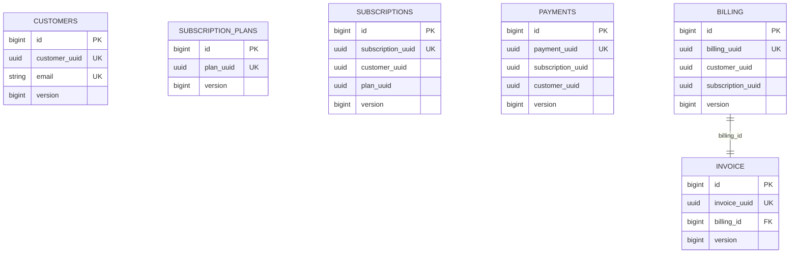

# Database reference

Postgres init creates four databases (`infrastructure/postgres/init/init.sql`); Flyway migrations define all tables. Cross-service UUIDs have no DB foreign keys.

Migrations: customer V1/V2 create `customers`, then password/role; subscription V1 plans, V2 subscriptions; payment V1 payments; billing V1 billing+invoice. Each entity has `@Version`; IDs are generated BIGSERIAL/IDENTITY and business identifiers UUIDs (`entity` classes and corresponding migrations). Billing→invoice is one-to-one with a unique FK; entity maps cascade ALL/orphan removal but `BillingServiceImpl` saves both explicitly. Migrations define indexes on common UUID/status fields as visible in the SQL files.

Consistency issues: subscriptions/payments/billing reference UUIDs without foreign keys; Payment entity declares `unique=true` for customerUuid and subscriptionUuid although migration does not, creating JPA-validation/mapping inconsistency; subscription migration ends `CREATE INDEX ... status)` without semicolon; `ddl-auto=validate` makes schema mismatches startup failures. No global transaction/saga/outbox, partitioning, database users, backups, or retention is found.
