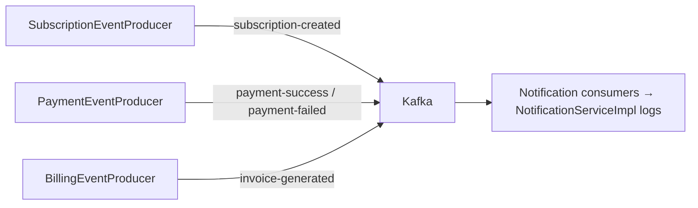

# Kafka reference

Kafka event classes and `KafkaTopics` are imported from `common-lib`, but their source is **Not found in repository**; names/payload members below are taken from producer/consumer usages.

| Topic constant | Producer / event | Consumer | Evidence |
|---|---|---|---|
| `SUBSCRIPTION_CREATED` | `SubscriptionEventProducer.publishSubscriptionCreatedEvent` / subscriptionUuid, customerUuid, planUuid, status | `SubscriptionCreatedConsumer.consume` | subscription/notification producer/consumer classes |
| `PAYMENT_SUCCESS` | `PaymentEventProducer.publishPaymentSuccessEvent` | `PaymentSuccessConsumer.consume` | payment/notification classes |
| `PAYMENT_FAILED` | `PaymentEventProducer.publishPaymentFailedEvent` | `PaymentFailedConsumer.consume` | payment/notification classes |
| `INVOICE_GENERATED` | `BillingEventProducer.publishInvoiceGeneratedEvent` | `InvoiceGeneratedConsumer.consume` | billing/notification classes |

Payment and billing producers use Spring JSON serializer without type headers; notification builds per-event `JsonDeserializer` factories and Jackson mix-ins, group `notification-service-group`, earliest reset (`Notification-service/src/main/java/.../KafkaConsumerConfig.java`; service properties). Subscription has a `KafkaProducerConfig` empty class and no subscription Kafka properties file, so its `KafkaTemplate` configuration is **not found in repository**. Producers attach `whenComplete` log callbacks only; listener retry, error handler, manual commits, DLT, idempotence, transactions, topic creation, retention, and an outbox are **not found in repository**. Event consumers do not persist or deliver messages; they log.
