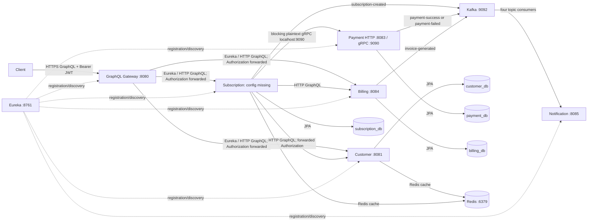

# Project architecture (source-audited 2026-07-24)

All evidence paths are repository-relative. Statements marked **Not found in repository** are deliberate.

## Inventory

| Module | Purpose / stack | Port, data, registration | Dependencies and calls |
|---|---|---|---|
| `discovery-server` | Spring Boot 4.1, Spring MVC, Eureka server. `DiscoveryServerApplication` is annotated `@EnableEurekaServer` (`discovery-server/src/main/java/com/subscriptionbilling/discovery/DiscoveryServerApplication.java`). | 8761; no DB; self-registration/fetch disabled (`discovery-server/src/main/resources/application.yml`). | Registry only. |
| `customer-service` | MVC GraphQL, JPA/Flyway/PostgreSQL, Redis cache, Spring Security/JWT, Actuator. | 8081; `customer_db`; Eureka client. | GraphQL only; no outbound business call. |
| `subscription-service` | MVC + WebFlux GraphQL, JPA/Flyway/PostgreSQL, Redis, Kafka producer, gRPC client. | **No `application.properties`/`.yml` found**; code needs `billing.service.url`, `customer.service.url`, Redis/Kafka/DB/Eureka settings. | Customer GraphQL, Payment gRPC `localhost:9090`, Billing GraphQL, Kafka. |
| `payment-service` | GraphQL, JPA/Flyway/PostgreSQL, Kafka producer, gRPC server. | HTTP 8083, gRPC 9090, `payment_db`, Eureka (`payment-service/src/main/resources/application.yml`). | Kafka only outbound. |
| `billing-service` | GraphQL, JPA/Flyway/PostgreSQL, Kafka producer. | 8084, `billing_db`, Eureka. | Kafka only outbound. |
| `Notification-service` | MVC, Kafka consumers, Eureka. | 8085; no DB. | Consumes four Kafka events and logs them. |
| `GraphQL-Gateway` | GraphQL façade, Eureka-load-balanced WebClient, Spring Security resource server, Bucket4j. | 8080; Eureka. | GraphQL to customer, subscription, billing. Payment has no gateway route. |
| `common-lib` | Declares Spring Kafka/Jackson/Lombok dependencies only (`common-lib/pom.xml`). | N/A | **No Java source found.** Yet event and topic classes are imported throughout; this prevents a clean build. |

Root Maven lists lowercase `notification-service` and `graphql-gateway`, while directories/artifact IDs are `Notification-service` and `GraphQL-Gateway` (`pom.xml`; respective POMs): case-sensitive builds will fail. `discovery-server` exists but is not a root module.

## Production topology actually represented

Postgres, Redis, Kafka, and Kafka UI are the only Compose services (`docker-compose.yml`). Application service containers, Compose startup dependencies, Dockerfiles, Kubernetes manifests, tracing backend, SMTP/provider, and REST controllers are **Not found in repository**.

## Startup and availability

`docker compose up` starts Postgres, Redis, Kafka, then Kafka UI after Kafka health; it does **not** start Discovery or any Java service (`docker-compose.yml`). Once separately launched, services register against `http://localhost:8761/eureka`; no `depends_on`/retry policy establishes the requested order Discovery → Customer → Subscription → Payment → Billing → Notification → Gateway. The required logical sequence for creating a subscription is Customer available, Payment gRPC available, Billing available, then Kafka; a failure in either synchronous external call causes `SubscriptionServiceImpl.createSubscription` to throw after possible earlier writes (`subscription-service/.../SubscriptionServiceImpl.java`).

## Runtime dependency graph

| Service | Called by | Calls | If unavailable |
|---|---|---|---|
| Customer | gateway; subscription | PostgreSQL, Redis | Gateway customer operations and subscription creation stop. |
| Subscription | gateway | Customer, Payment, Billing, PostgreSQL/Redis/Kafka | gateway plan/subscription operations stop. |
| Payment | subscription | PostgreSQL/Kafka | subscription creation stops at gRPC. |
| Billing | gateway; subscription | PostgreSQL/Kafka | subscription creation throws after payment and subscription save. |
| Notification | Kafka | logging only | business records remain; notification log output is absent. |
| Discovery | all Eureka clients | none | direct service calls may still work only if discovery clients are already resolved; behaviour beyond config is **Not found in repository**. |

## Technology/dependency summary

All application modules use Java 17 and Spring Boot 4.1 parent (`pom.xml`/module POMs); Spring Cloud BOM is 2025.1.2. POMs enumerate starters precisely. Database driver is PostgreSQL in customer/subscription/payment/billing. Gateway and subscription use WebClient + LoadBalancer; only subscription declares gRPC client, payment declares gRPC server. Service registration is Eureka client in every app except subscription's configuration is missing. No circuit breaker, distributed tracing, outbox, saga, or service-specific Docker configuration is found.

Starter/library inventory: customer declares Actuator, WebMVC, Security, Cache, Data JPA, GraphQL, Data Redis, Flyway, Eureka, MapStruct, validation, PostgreSQL and Lombok; subscription declares Actuator, Cache, JPA, Redis, GraphQL, Flyway, validation, WebMVC/WebFlux, Eureka, LoadBalancer, gRPC client/services, PostgreSQL and Lombok; payment declares GraphQL, JPA, Flyway, validation, WebMVC, Kafka, gRPC server, Eureka, PostgreSQL and Lombok; billing declares Actuator, JPA, Flyway, validation, WebMVC, Kafka, GraphQL, Eureka, PostgreSQL, `common-lib`, Lombok; notification declares Actuator, validation, WebMVC, Kafka, Eureka, `common-lib`, Lombok; gateway declares Actuator, validation, WebMVC, Security, OAuth2 resource server, GraphQL, Eureka, Bucket4j 8.14.0, LoadBalancer and WebFlux (all respective `pom.xml` files). Discovery declares WebMVC and Eureka server (`discovery-server/pom.xml`).

Packages with application logic are rooted at `com.ayush.subscription.customer`, `.subscription`, `.payment`, `.billing`, `.notification`, and `.gateway`; discovery uses `com.subscriptionbilling.discovery`. Each service uses the standard Spring entrypoint named `*ServiceApplication.main` (or `GraphQlGatewayApplication.main`), at the module's `src/main/java` root. No REST API package, REST controller, OpenAPI definition, generated gRPC Java source, or shared Java package is present in the repository.
