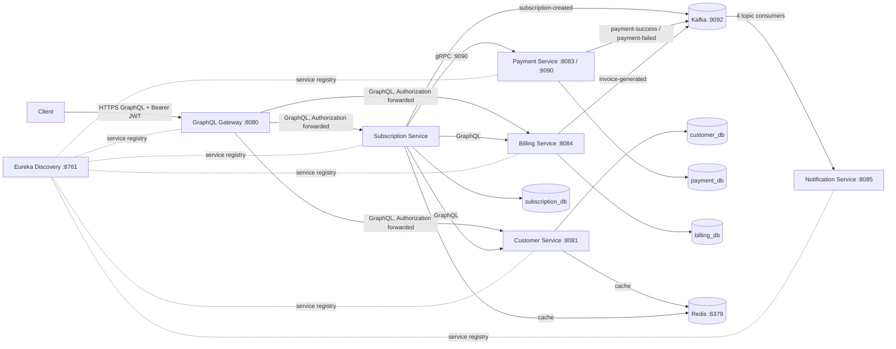
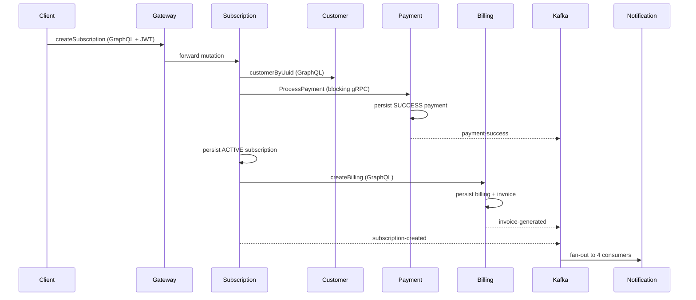
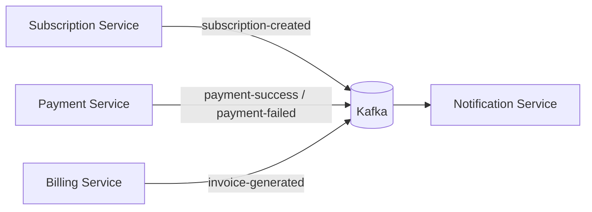
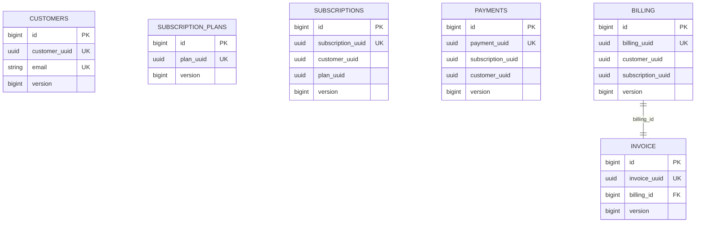

<div align="center">

# 🧾 Subscription Billing Platform

**A distributed, event-driven subscription & billing system built on Spring Boot, GraphQL, gRPC, Kafka, Redis, and PostgreSQL.**

[](.)
[](.)
[](.)
[](.)
[](.)
[](.)
[](.)
[](.)
[](./LICENSE)

</div>

---

## 📖 Overview

**Subscription Billing Platform** is a microservices-based system that models a real-world SaaS billing pipeline: customer onboarding, plan management, subscription lifecycle, payment processing, invoicing, and event-driven notifications — fronted by a single **GraphQL Gateway** and backed by **service discovery, Redis caching, and Kafka eventing**.

It's built as **7 independently deployable services**, communicating through a mix of **GraphQL** (client-facing and service-to-service), **gRPC** (low-latency subscription ↔ payment calls), and **Kafka** (asynchronous domain events) — the kind of polyglot-protocol architecture you'd find in a production fintech billing system.

| | |
|---|---|
| **Domain** | Subscription commerce — customers, plans, subscriptions, payments, billing, invoices, notifications |
| **Architecture style** | Microservices + API Gateway (façade) + event-driven eventing |
| **Services** | 7 (Discovery, Customer, Subscription, Payment, Billing, Notification, Gateway) |
| **Primary API style** | GraphQL (per-service schemas, gateway-aggregated) |
| **Inter-service RPC** | gRPC (Subscription → Payment) |
| **Eventing** | Kafka (subscription / payment / invoice domain events) |
| **Persistence** | PostgreSQL per service (4 databases), Flyway-versioned schemas |
| **Caching** | Redis (customer, plan, subscription lookups) |
| **AuthN** | JWT (HS256), issued by Customer Service, verified at the Gateway |

---

## 🏗️ Architecture

### Service topology



### Service inventory

| Service | Responsibility | Port | Key stack |
|---|---|---|---|
| **discovery-server** | Eureka service registry | `8761` | Spring Cloud Netflix Eureka |
| **customer-service** | Registration/login, JWT issuance, customer CRUD | `8081` | Spring GraphQL, JPA, Flyway, Redis, Spring Security |
| **subscription-service** | Plan & subscription lifecycle orchestration | *(configurable)* | Spring GraphQL (MVC+WebFlux), JPA, Redis, Kafka producer, gRPC client |
| **payment-service** | Payment processing, gRPC server | HTTP `8083` / gRPC `9090` | Spring GraphQL, JPA, Kafka producer, gRPC server |
| **billing-service** | Billing computation + invoice generation | `8084` | Spring GraphQL, JPA, Kafka producer |
| **Notification-service** | Consumes domain events, dispatches notifications | `8085` | Kafka consumer group |
| **GraphQL-Gateway** | Single client-facing entry point, JWT verification, rate limiting | `8080` | Spring GraphQL, Eureka-aware WebClient, Bucket4j |
| **common-lib** | Shared Kafka event/topic contracts | — | Shared dependency module |

Full package roots: `com.ayush.subscription.{customer,subscription,payment,billing,notification,gateway}`; discovery uses `com.subscriptionbilling.discovery`.

---

## 🔄 Core business flows

### 1. Customer registration & login

```
AuthMutation.register → AuthenticationServiceImpl.register → CustomerRepository.existsByEmail/save
AuthMutation.login    → AuthenticationServiceImpl.login    → findByEmail + BCrypt match → JwtUtil.generateToken
```

Passwords are BCrypt-hashed; new customers are created `ACTIVE`/`CUSTOMER`. Login issues an **HS256 JWT** carrying `subject`, `email`, `customerUuid`, and `role` claims.

### 2. Subscription creation → payment → billing → notification

This is the flagship end-to-end flow, spanning five services and three protocols in a single request:



Billing computes `base − discount + tax` and generates a `GENERATED` invoice. Every hop in this chain is synchronous and un-compensated — see [Known Limitations](#-known-limitations--engineering-roadmap) for what that means operationally.

### 3. Plan & CRUD flows

Customer, Plan, Payment, and Billing all expose full CRUD through their GraphQL mutations, with **optimistic locking** (`@Version` on every entity) guarding concurrent writes.

---

## 🌐 API surface (GraphQL)

Every service owns its own `.graphqls` schema; the **Gateway performs client-side aggregation** (hand-written `HttpGraphQlClient` calls per downstream service), not schema stitching — each resolver on the gateway builds and forwards its own downstream document.

| Service | Queries | Mutations | Notes |
|---|---|---|---|
| **Customer** | `customerByUuid`, `customers` | `register`, `login`, customer CRUD | Auth entry point |
| **Subscription** | plans, subscriptions | plan/subscription CRUD | Orchestrates payment + billing |
| **Payment** | `getPayment`, payment history | create/update/delete | gRPC-mirrored |
| **Billing** | health, billing, invoice | `createBilling` | Computes invoice totals |
| **Gateway** | customer/plan/subscription/billing routes | customer/plan/subscription routes | Auth + payment intentionally excluded from schema |

All gateway routes require a **Bearer JWT** except `/graphiql/**` and `/actuator/health`, and the gateway forwards the `Authorization` header downstream on every proxied call.

---

## ⚡ Inter-service communication

| Mechanism | Used for | Detail |
|---|---|---|
| **GraphQL (HTTP)** | Gateway → services, Subscription → Customer/Billing | Hand-written client documents via `HttpGraphQlClient` / `WebClient` |
| **gRPC (unary, blocking)** | Subscription → Payment | `ProcessPayment` / `GetPaymentHistory` defined in `payment.proto`; plaintext channel on `:9090` |
| **Kafka (async)** | Payment/Billing/Subscription → Notification | Domain events below |

### Kafka event flow



| Topic | Producer | Consumer |
|---|---|---|
| `SUBSCRIPTION_CREATED` | `SubscriptionEventProducer` | `SubscriptionCreatedConsumer` |
| `PAYMENT_SUCCESS` | `PaymentEventProducer` | `PaymentSuccessConsumer` |
| `PAYMENT_FAILED` | `PaymentEventProducer` | `PaymentFailedConsumer` |
| `INVOICE_GENERATED` | `BillingEventProducer` | `InvoiceGeneratedConsumer` |

Notification consumer group: `notification-service-group`, offset reset `earliest`.

---

## 🗄️ Data model

Four independent PostgreSQL databases (one per owning service), Flyway-versioned, with `BIGSERIAL` primary keys and UUID business identifiers:



Cross-service references (e.g. `customer_uuid` on `SUBSCRIPTIONS`) are **UUID-linked, not foreign-keyed** — a deliberate microservices trade-off (no cross-database FK), consistent with each service owning its own schema.

Every entity carries `@Version` for **optimistic concurrency control**.

---

## 🚀 Caching strategy

Redis-backed `@Cacheable` / `@CachePut` / `@CacheEvict` on the hot read paths, JSON-serialized, 30-minute default TTL:

| Cache | Populated by | Invalidated by |
|---|---|---|
| `customers` | `getCustomerByUuid` | `updateCustomer`, `deleteCustomer` |
| `subscriptionPlans` | `getPlanByUuid` | `updatePlan`, `deletePlan` |
| `subscriptions` | `getSubscriptionByUuid` | `updateSubscription`, `cancelSubscription` |

---

## 🔐 Security

- **JWT (HS256)** issued by Customer Service on login, containing `subject`, `email`, `customerUuid`, `role`
- **86,400,000 ms (24h) expiry**
- Gateway validates the JWT using the shared secret and enforces auth on all routes except `/graphiql/**` and `/actuator/health`
- Gateway forwards `Authorization` downstream so services can (in principle) re-validate per-request context
- **Rate limiting** via Bucket4j at the gateway (20 requests/min per IP in current config)

---

## 🛠️ Tech stack

<table>
<tr>
<td valign="top">

**Language & Framework**
- Java 17
- Spring Boot 4.1
- Spring Cloud 2025.1.2

**API layer**
- Spring GraphQL
- gRPC (Protocol Buffers)

**Data**
- PostgreSQL
- Flyway
- Redis

</td>
<td valign="top">

**Messaging**
- Apache Kafka
- Spring Kafka

**Service mesh basics**
- Eureka (discovery)
- Spring Cloud LoadBalancer
- Bucket4j (rate limiting)

**Security**
- Spring Security
- JWT (HS256)

**Build & infra**
- Maven (multi-module)
- Docker Compose (infra layer)
- Lombok, MapStruct

</td>
</tr>
</table>

---

## 📦 Getting started

### Prerequisites
- Java 17
- Maven 3.9+
- Docker & Docker Compose

### 1. Start infrastructure

```bash
docker compose up
```

This brings up **PostgreSQL** (`5432`), **Redis** (`6379`), **Kafka** (`9092`, single-node KRaft), and **Kafka UI** (`8090`). Postgres init scripts provision all four databases automatically.

### 2. Start services (in order)

```bash
# 1. Discovery
cd discovery-server && mvn spring-boot:run

# 2. Domain services (each in its own terminal)
cd customer-service      && mvn spring-boot:run   # :8081
cd subscription-service  && mvn spring-boot:run
cd payment-service       && mvn spring-boot:run   # HTTP :8083 / gRPC :9090
cd billing-service       && mvn spring-boot:run   # :8084
cd Notification-service  && mvn spring-boot:run   # :8085

# 3. Gateway last
cd GraphQL-Gateway && mvn spring-boot:run          # :8080
```

> Services register with Eureka at `http://localhost:8761/eureka`. Bring services up in the order above so downstream calls (Subscription → Customer/Payment/Billing) have somewhere to resolve to.

### 3. Explore the API

Open the Gateway's GraphiQL console:

```
http://localhost:8080/graphiql
```

Register a customer, log in to obtain a JWT, and pass it as a `Bearer` token on subsequent requests.

---

## ✅ Testing checklist

A full manual verification pass covers:

- **Infra health** — Postgres/Redis/Kafka/Kafka UI, plus `/actuator/health` per service
- **Auth** — register/login, duplicate email, invalid/expired/tampered JWT
- **Gateway** — end-to-end query/mutation flows, header forwarding, rate-limit thresholds
- **Subscription pipeline** — full happy path, plus induced failures at each downstream hop
- **Payment** — GraphQL + gRPC parity, malformed input, terminal-state transitions
- **Billing** — invoice math, uniqueness constraints, negative-value validation
- **Kafka** — consumer restart/offset behavior, poison-message handling
- **Concurrency** — optimistic-lock conflicts under parallel updates
- **Resilience** — behavior under Postgres/Redis/Kafka outage

---

## ⚠️ Known limitations & engineering roadmap

This project is shared in the spirit of an **honest engineering audit**, not a polished sales pitch — the architecture is deliberately ambitious (7 services, 3 communication protocols, full event pipeline), and the list below is what stands between the current state and a genuinely production-ready system. Treat it as the roadmap, not a warning label:

| Area | Current state | Next step |
|---|---|---|
| **Registration token** | `register` returns a null access token; a separate `login` call is required | Return a token on registration, or make that contract explicit in the schema |
| **Authorization enforcement** | Method-level `@PreAuthorize` exists but isn't wired into the active security filter chain | Enable `@EnableMethodSecurity` and activate the JWT filter in each service |
| **Payment processing** | Always returns `SUCCESS`; no real processor integration | Integrate a real/sandbox payment processor with failure paths |
| **Distributed consistency** | No saga/outbox — a Billing failure after Payment + Subscription writes leaves them uncompensated | Introduce an outbox pattern or a saga orchestrator for the subscription pipeline |
| **Resilience** | Synchronous GraphQL/gRPC calls have no timeout, retry, or circuit breaker | Add Resilience4j timeouts/retries/circuit breakers on all inter-service calls |
| **Notifications** | Kafka consumers log events only; no real delivery | Wire in an email/SMS/push provider |
| **Build wiring** | `common-lib` declares dependencies but ships no source; module casing mismatches (`notification-service` vs `Notification-service`) break a clean multi-module build | Populate `common-lib` with shared event/topic classes; normalize module names |
| **Subscription-service config** | No `application.yml` checked in; required properties (`billing.service.url`, `customer.service.url`, DB/Redis/Kafka) are undocumented | Add environment-specific config and a sample `.env` |
| **Renewals & retries** | No renewal scheduler, payment retry workflow, or DLT | Add a scheduled renewal job and dead-letter handling |
| **Deployment** | Docker Compose covers infra only — no Dockerfiles or Kubernetes manifests for the services themselves | Containerize each service; add Helm charts / K8s manifests |
| **Secrets** | Default JWT secret is committed for local dev | Externalize via environment variables / a secrets manager before any real deployment |

---

## 🗺️ Project structure

```
subscription-billing-platform/
├── discovery-server/          # Eureka registry
├── customer-service/          # Auth, customer CRUD, Redis cache
├── subscription-service/      # Subscription orchestration, gRPC client, Kafka producer
├── payment-service/           # Payment processing, gRPC server
├── billing-service/           # Billing + invoice generation
├── Notification-service/      # Kafka consumers
├── GraphQL-Gateway/           # Client-facing façade, JWT verification, rate limiting
├── common-lib/                # Shared Kafka event/topic contracts
├── infrastructure/
│   └── postgres/init/         # Database bootstrap SQL
└── docker-compose.yml         # Infra-only compose stack
```

---

## 🤝 Contributing

Issues and PRs are welcome — the [Known Limitations](#-known-limitations--engineering-roadmap) table above is effectively a live backlog if you're looking for where to start.

## 📄 License

Distributed under the MIT License. See `LICENSE` for details.

---

<div align="center">
Built by <b>Ayush Dubey</b> — a hands-on exploration of microservices, GraphQL federation patterns, gRPC, and event-driven billing systems.
</div>
